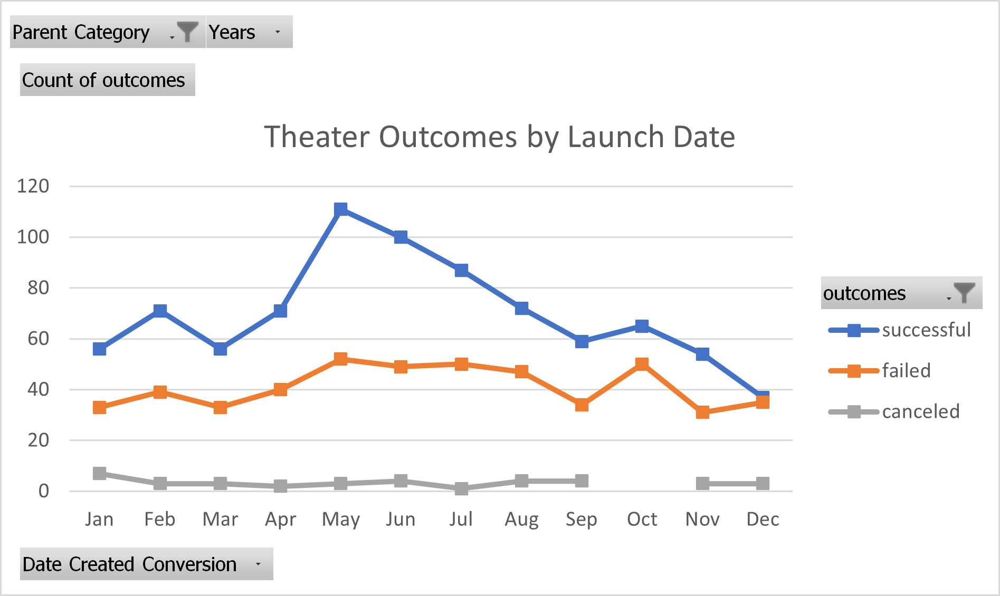

# Kickstarting with Excel

## The purpose of this analysis is to enable Lousie to compare her fundraising compaign against other theaters' campaigns.

### By comparing how her play, Fever, did, she will be able to understand whether she launched her campaign in the most appropriate month, and whether her fundraising goal was too high or too low to succeed.

## Analysis and Challenges

### Outcomes by Launch Date:

### Outcomes by Goal:

### I didn't encounter any difficulties, but potential areas of difficulty could have been: 
- Forgetting to filter the chart on Theater or Plays only
- Forgetting a goal number which would result in the total number of Successful, Failed and Canceled campaigns not adding up to the number in the Kickstarted tab

## Results

- What are two conclusions you can draw about the Outcomes based on Launch Date?
1. Most successful Theater campaigns were launched in May
2. No Theater campaigns were canceled in October
3. There were as many Successful Theater campaigns as there were were Failed ones when they were launched in December

- What can you conclude about the Outcomes based on Goals?
1. Most Plays with a campaign goal of $20,000 to $34,999 and over $44,999 failed
2. It is best to launch Plays campaign with a maximum goal of $19,999 in order to succceed in achieving her goal

- What are some limitations of this dataset?
1. These 2 charts do not take into account by how much the campaigns fail to achieve their goals
2. We also do not know the extend of the marketing/visibility of these campaigns, i.e. how they were advertised
3. We do not show the success rate of these campaigns over time, i.e. we are not looking at the years they were launched, but just the months

- What are some other possible tables and/or graphs that we could create?
1. Percent / number of campaign goals achieved / missed by year and/or by month
2. Percent / number of campaigns successful / failed by country
3. Percent / number of campaigns successful / failed by number of donors

